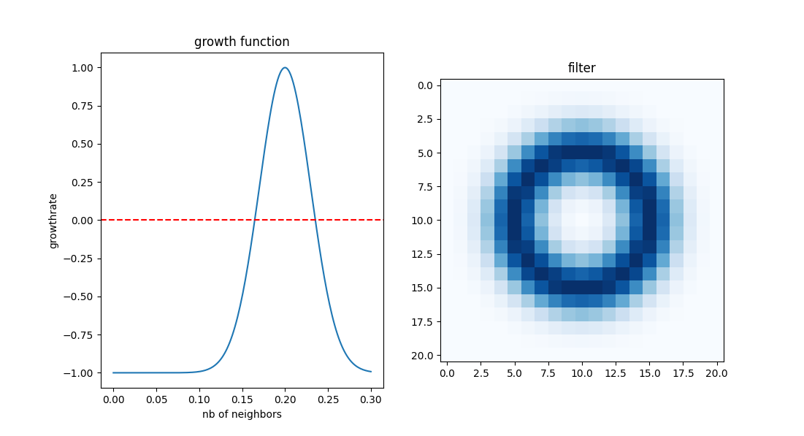
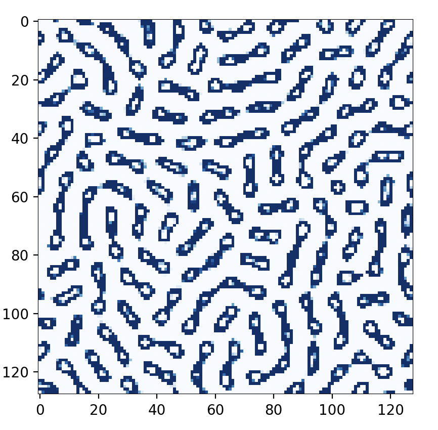

# Cellular Automaton: Lenia

This Python project is an implementation and exploration of a continuous version of Conway's Game of Life inspired by ScienceEtonnante's video. It is based on Lenia, a continuous cellular automaton originally developed by Bert Wang-Chak Chan. Lenia is a continuous generalization of the Game Of Life with continuous states, space and time.

## Inspiration and References

- [ScienceEtonnante's Video](https://www.youtube.com/watch?v=PlzV4aJ7iMI&t=21s)
- [ScienceEtonnante's GitHub Repo](https://github.com/scienceetonnante/lenia/tree/main)
- [Lenia GitHub Repo](https://github.com/Chakazul/Lenia)
- [Lenia Portal](https://chakazul.github.io/lenia.html)

## Installation

1. Clone the repository:

    ```bash
    git clone https://github.com/timothja/GameOfLife_Lenia
    cd GameOfLife_Lenia
    ```

2. Install the required packages:

    ```bash
    pip install -r requirements.txt
    ```

## Usage

Run the main script to execute the cellular automaton simulation:

```bash
cd src
python3 Lenia.py
```

## What you should get

Growth function and kernel used:



End result after a 280 generations of a random initialization state:


